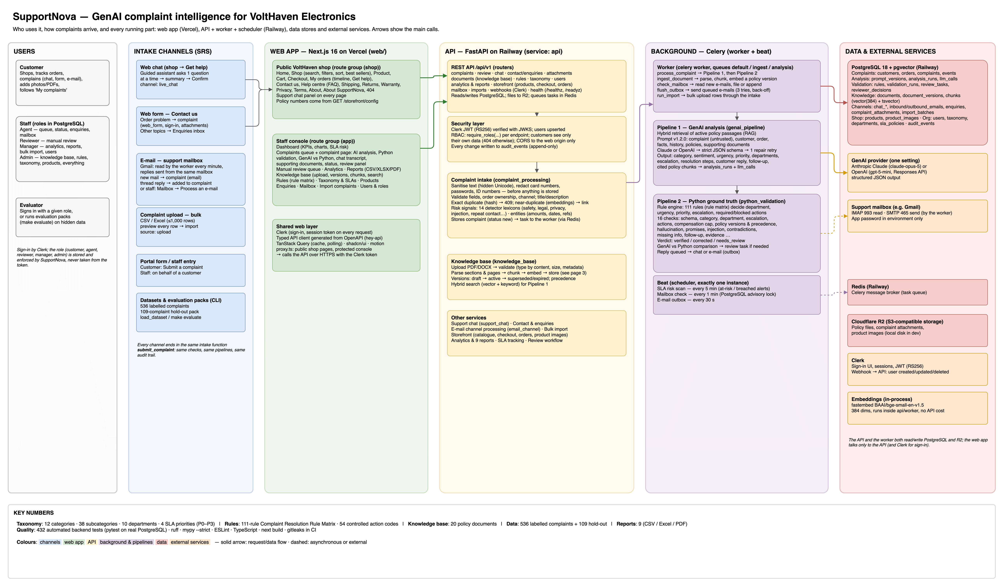
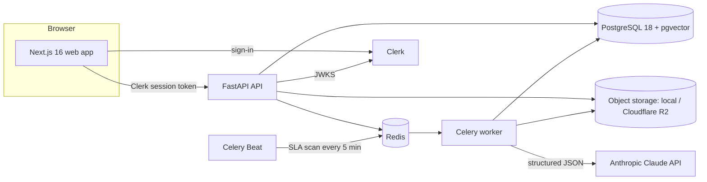
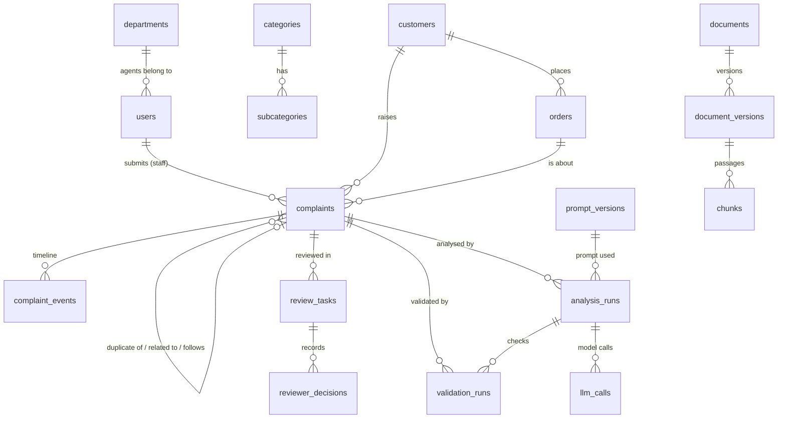
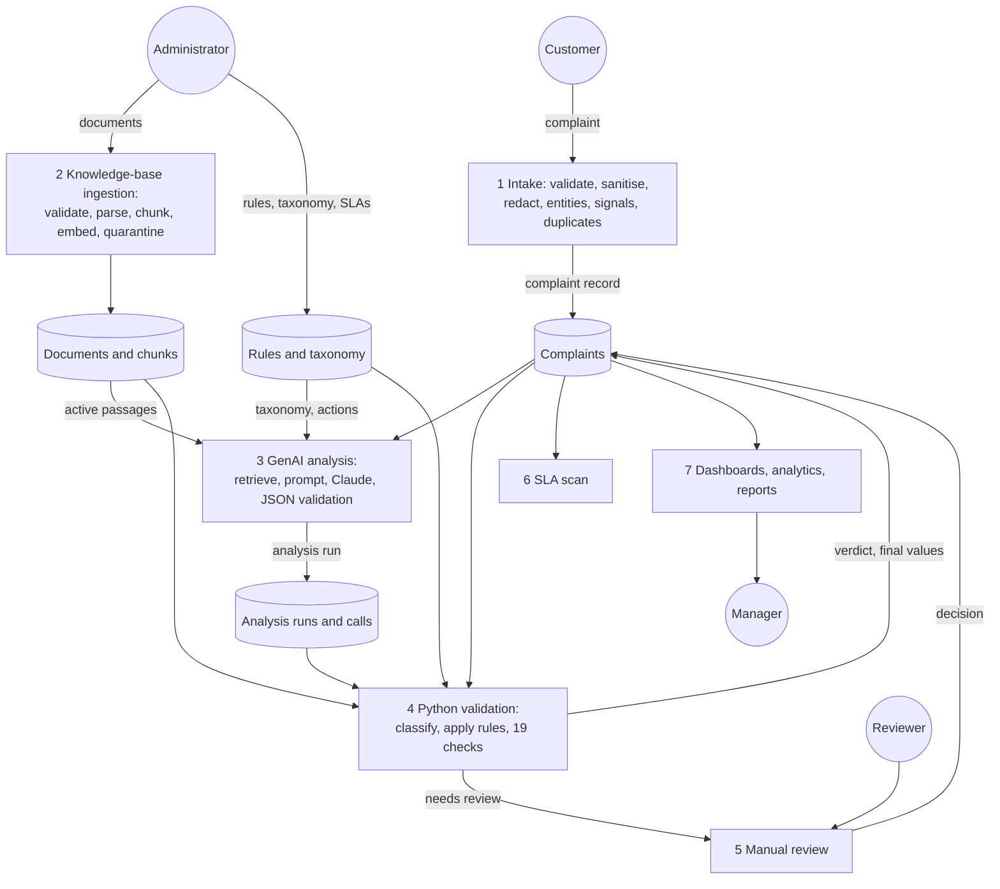
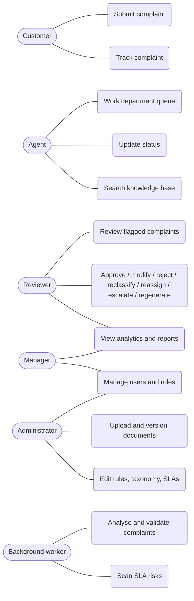
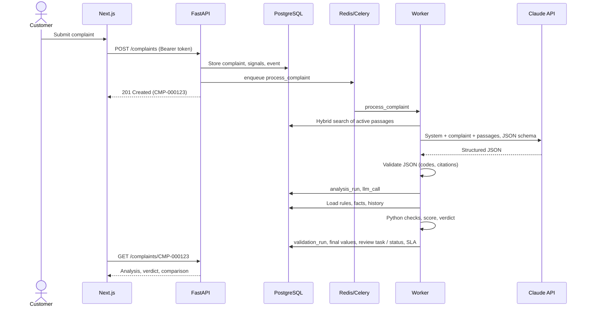

# SupportNova: Project Report

**Customer Complaint Resolution Intelligence with Generative AI and Python Ground-Truth
Validation**

Organisation: VoltHaven Electronics (fictional consumer-electronics e-commerce company)
Team: _team name and members_ · Date: September 2026

Diagrams use Mermaid and render on GitHub.

---

## 1. Problem definition

Customer-service teams receive complaints as free text through many channels. Each one must
be understood, classified, routed to the right department, prioritised by risk, checked
against company policy, answered and sometimes escalated. Done by hand this is slow and
inconsistent; done by a generative model alone it is fast but unreliable, since a model can
misclassify, overlook a mandatory escalation, invent a policy, or promise a refund the
company does not allow.

The problem is to use Generative AI for the language work while guaranteeing that every
business decision follows the company's approved rules and policies.

## 2. Background

- Complaint handling in e-commerce involves delivery, product faults, billing, refunds,
  returns, warranty, accounts, privacy, safety, service quality and staff conduct, each with
  its own department, service levels and escalation paths.
- Large language models are strong at reading unstructured text, extracting facts and
  writing empathetic replies, and can return structured JSON.
- They are weak at following long, exact rule sets, and are vulnerable to prompt injection:
  complaint text is untrusted input written by the public.
- Regulated or high-risk cases (safety, personal data, legal threats) need auditable,
  deterministic handling and a human in the loop.

## 3. Proposed solution

A web application with two independent pipelines:

1. **GenAI Complaint Intelligence Pipeline (Pipeline 1)**: retrieves the relevant active
   policy passages and asks Claude for a structured JSON analysis (classification,
   sentiment, urgency, routing, policy citations, resolution steps, compensation,
   escalation, customer response, follow-up).
2. **Python Ground-Truth Validation Pipeline (Pipeline 2)**: independently classifies the
   complaint, applies the Complaint Resolution Rule Matrix and escalation rules to facts
   computed in Python, and checks every part of the GenAI output: routing, priority,
   escalation, required and prohibited actions, compensation limits, policy currency and
   precedence, unsupported promises, untraceable facts and injection handling.

The **GenAI proposes; Python decides**. Python never uses GenAI output as evidence: it keeps
the more severe of the two for urgency, priority and escalation, removes prohibited actions,
and sends anything it cannot settle to a human reviewer.

## 4. Purpose

- Resolve complaints faster with consistent, policy-grounded recommendations.
- Never let an automated answer promise something the policy does not allow.
- Detect critical complaints (safety, privacy, account takeover, legal) whatever their tone.
- Give managers visibility: volumes, trends, SLA risk, validation quality.
- Stay adaptable: categories, departments, SLAs, rules and policies are data, not code.

## 5. Scope

In scope: complaint intake (web), knowledge base (PDF/DOCX/TXT/MD with versioning), rule
matrix, both pipelines, comparison, manual review, status lifecycle, SLA tracking,
dashboards, analytics, trends, reports with CSV/Excel/PDF export, role-based access,
auditing, evaluation tooling, deployment.

Out of scope: real email, chat or telephony integrations, real payment or courier systems
(orders are simulated), OCR of scanned documents, sending responses to customers
automatically, multiple languages.

## 6. Constraints

- Python is mandatory for the pipelines; GenAI must return structured output; the Python
  pipeline must not use GenAI to approve anything.
- Fictional organisation, data and policies; no real customer data.
- API keys never in the repository.
- Analysis should complete within about 20 seconds.
- Hidden evaluation data, new categories and policy updates must be handled without
  changing the architecture.

## 7. Functional requirements (implemented)

| Area | Implementation |
|---|---|
| Complaint intake (SRS Steps 1–10) | Web form for customers and staff; validation (length, order ownership, channel); sanitisation of hidden characters; sensitive-data redaction; entity extraction; exact-duplicate rejection; near-duplicate and reworded-repeat linking; risk signals |
| Knowledge base (11–20) | Upload with type/size/metadata validation; parsing to sections with page numbers; chunking; embeddings; hybrid retrieval; version lifecycle (draft, active, superseded, previous, retired); precedence; quarantine of instruction-like passages |
| GenAI analysis (21–40) | Versioned prompt; JSON schema generated from the live taxonomy; Claude structured output; Python validation of the JSON; one repair retry; manual review on failure; full call logging |
| Rule matrix (41–46) | 79 resolution rules and 32 escalation rules in CSV, seeded to the database, editable in the UI; safe condition language |
| Ground-truth validation (47–52) | Independent classifier; 19 checks; score and verdict; enforced corrections; comparison table |
| Review, status, repeats (53–60) | Review queue; 8 reviewer actions with before/after records; status transitions; repeat detection |
| Dashboards and analytics (61–66) | Customer, agent and management dashboards; analytics; trend detection; search and filters |
| Reports and export (67–68) | 9 reports; CSV, Excel, PDF |
| SLA (55–56) | Deadlines per priority, SLA status, periodic risk scan |
| Orders and currency | Shop orders move through placed → packed → shipped → out for delivery → delivered (or lost, cancelled, returned) automatically and by staff, with a full history, order e-mails, customer cancel and return, PDF receipts, and prices in the visitor's currency (PKR in Pakistan; rates refreshed twice a day); the rule-facing order status is unchanged |
| Administration | Settings page: e-mail timing, automatic replies, AI provider/model/effort, auto-analysis, review thresholds, SLA scan interval, shop and console branding with logos; changes apply within 15 s without a redeploy and are audited |

## 8. Non-functional requirements

| Requirement | How it is met |
|---|---|
| Security | Clerk RS256 tokens verified on every request; roles in PostgreSQL; per-endpoint role checks; ownership checks; CORS allow-list; secrets in environment only; gitleaks in CI; redaction; audit trail |
| Reliability | Background jobs with retries (Celery, acks-late); provider outages fall back to Python-only validation; invalid GenAI output never used |
| Performance | Retrieval with indexes (pgvector, full-text); prompt caching of the system prompt; low-effort structured output; latency measured per complaint (`make evaluate`) |
| Traceability | Every analysis stores prompt name/version/hash, model, schema fingerprint, retrieved passages (document, version, section, page), attempts, tokens, latency and raw responses; every change audited |
| Maintainability | Typed Python (mypy strict), typed TypeScript client generated from OpenAPI, 526 automated tests, CI |
| Configurability | Taxonomy, SLAs, rules and documents in the database; vocabularies, detectors, validation limits, analytics thresholds in YAML |
| Usability | Accessible UI components (Radix/shadcn), light and dark themes, responsive layout |

## 9. Application architecture

The complete architecture is drawn in four diagrams (source: `documentation/architecture.drawio`):
[architecture overview](diagrams/1-architecture-overview.png),
[complaint lifecycle](diagrams/2-complaint-lifecycle.png),
[knowledge base and RAG](diagrams/3-knowledge-base-rag.png) and
[deployment, CI and security](diagrams/4-deployment-ci-security.png).



The summary below shows the same structure in text form.



| Layer | Technology |
|---|---|
| Frontend | Next.js 16 (App Router), React 19, TypeScript, Tailwind CSS 4, shadcn/ui, TanStack Query, Recharts |
| API | Python 3.13, FastAPI, Pydantic 2, SQLAlchemy 2.1, Alembic |
| Jobs | Celery, Redis, Celery Beat |
| Knowledge base | PyMuPDF, python-docx, fastembed (bge-small-en-v1.5), pgvector, PostgreSQL full-text search |
| GenAI | Anthropic Claude (`claude-opus-5`, configurable), JSON-schema structured output |
| Reports | openpyxl (Excel), ReportLab (PDF) |
| Auth | Clerk (identity) + roles in PostgreSQL |
| Deployment | Vercel (web), Railway (API, worker, beat, PostgreSQL, Redis), Cloudflare R2 |

## 10. Module descriptions

| Module (folder) | Responsibility |
|---|---|
| `src/` | FastAPI app, routes, schemas, settings, storage, logging, Celery app; `src/analytics/` (dashboards, analytics, trends, reports, exports) |
| `security/` | Clerk token verification, user provisioning, role dependencies |
| `database/` | ORM models, sessions, audit helpers, seed and bootstrap, migrations |
| `document_processing/` | File validation, PDF/DOCX/TXT/MD parsing, chunking |
| `knowledge_base/` | Ingestion, quarantine, versioning, embeddings, hybrid retrieval, policy-update impact |
| `complaint_processing/` | Intake, sanitisation, redaction, entities, risk signals, facts, duplicates, review, status, SLA, background tasks |
| `complaint_rules/`, `escalation_rules/`, `routing_rules/` | Rule matrix CSVs, condition language, rule engine, routing configuration |
| `genai_pipeline/` | Vocabulary, JSON schema, prompt registry, provider adapter, output validation, pipeline, CLI, evidence export |
| `prompt_templates/`, `schemas/` | Versioned prompt template, output contract |
| `python_validation/` | Independent classifier, 19 checks, scoring, verdicts, pipeline, triage |
| `hallucination_checks/` | Unsupported promises, untraceable facts |
| `comparison_engine/` | GenAI vs Python comparison, baseline, evaluation of unseen packs |
| `sample_documents/`, `sample_complaints/`, `hidden_test_ready/` | 20 policy documents, 536-complaint dataset, 109-complaint hold-out pack |
| `storefront/` | Demo shop: product catalogue, checkout (one order per line, server prices), order tracking, admin demo delivery outcomes |
| `app_settings/` | Run-time settings (validated, stored as changes from the defaults, cached 15 s), policy facts, logos, and the settings-driven scheduler tick |
| `support_chat/` | Support chat: guided intake (GenAI or fixed questions, promise guard), conversation state, reply hooks from validation and review |
| `web/` | Next.js frontend: VoltHaven shop and chat (public) and the staff console |
| `tests/` | Unit, integration and security tests |

## 11. Database design



| Table | Key contents |
|---|---|
| `users` | Clerk ID, e-mail, role, department, active |
| `departments`, `categories`, `subcategories`, `sla_policies` | Runtime-configurable taxonomy and response/resolution targets per priority |
| `customers`, `orders` | Simulated customer records and order history (amounts, dates, shipping) |
| `complaints` | Text, entities, risk signals, intake warnings, classification, verification verdict, approved response, duplicate links, embedding, SLA deadlines and status |
| `complaint_events` | Status timeline (customer-visible or staff-only) |
| `documents`, `document_versions`, `chunks` | Knowledge base with version lifecycle, warnings, passages with section/page, embeddings (384-d), full-text vector, quarantine flag |
| `rules` | Resolution and escalation rules with version numbers |
| `prompt_versions`, `analysis_runs`, `llm_calls` | Prompt registry, each analysis and each model call with request and raw response |
| `validation_runs` | Checks, score, verdict, Python decision, comparison, corrections, review reasons |
| `review_tasks`, `reviewer_decisions` | Manual review and each decision's before/after state |
| `audit_events` | Append-only record of every change |

## 12. Data flow diagram



## 13. Use case diagram



## 14. Activity diagram (complaint processing)

```mermaid
flowchart TD
  start([Complaint submitted]) --> valid{Valid input?}
  valid -- no --> reject([Rejected with reasons])
  valid -- yes --> dup{Exact duplicate?}
  dup -- yes --> reject
  dup -- no --> store[Store: redacted text, signals, links] --> queue[Queue analysis]
  queue --> retrieve[Retrieve active policy passages] --> call[Call Claude with JSON schema]
  call --> ok{Output valid?}
  ok -- no, first time --> retry[Retry with the errors] --> call
  ok -- no, again / refusal --> genaiFail[Record failure]
  call -. provider down .-> genaiFail
  ok -- yes --> validate
  genaiFail --> validate[Python validation: rules and checks]
  validate --> verdict{Verdict}
  verdict -- verified / corrected --> route[Apply final values, assign or escalate, SLA deadlines]
  verdict -- needs review --> review[Manual review task]
  review --> decide[Reviewer decision] --> route
  route --> work[Agents work the complaint] --> resolved([Resolved / closed])
```

## 15. Sequence diagram (analysis and validation)



## 16. Complaint-processing pipeline

1. **Intake** (`complaint_processing/service.py`): Unicode normalisation and invisible
   characters removed; card numbers, passwords, PINs, ID and bank numbers redacted; length,
   channel and order-ownership checks; entities (orders, amounts, dates, e-mails); exact
   duplicates rejected (content hash); near-duplicates (fuzzy ≥ 88%) and reworded repeats
   (embedding ≥ 0.80) linked; risk signals from `config/detectors.yaml`.
2. **Facts** (`complaint_processing/facts.py`): days late (business days), order amount,
   shipping method, days since delivery, customer type, repeat count (complaints at least 24
   hours earlier), unresolved repeats, signals.
3. **Pipeline 1**, then **Pipeline 2**, in a Celery task (`complaint_processing/tasks.py`).
4. **Outcome**: final values applied, status to Assigned or Escalated with a customer
   message, or a review task; SLA deadlines set.

**Chat channel.** Customers can also complain through the support chat in the demo shop. A
separate, versioned intake prompt (`prompt_templates/chat_intake.yaml`) asks one question at a
time and returns structured JSON (`schemas/chat_intake.py`); any bot message that commits to a
remedy or date is replaced with a neutral question, and fixed questions are used when the
GenAI is unavailable. On Confirm the complaint is filed with `submit_complaint` (channel
`live_chat`), with a description made only of the customer's own messages, and goes through
Pipeline 1 and Pipeline 2 unchanged. Validation posts the reply into the chat when the verdict
is verified or corrected, otherwise a holding message; reviewer approvals are posted too.

## 17. Knowledge-base processing

1. Validation: file type by content (not only extension), size, metadata (Document ID
   format, category, version, dates) from the form or header lines.
2. Parsing: PDF (PyMuPDF, font-size and bold heuristics for headings, pages), DOCX (heading
   styles), Markdown/TXT; ligatures and full-width characters normalised.
3. Chunking: by section, split to ≤ 450 tokens with 60-token overlap; chunk code
   `DOC@VERSION#NNN` with section, heading and pages.
4. Embedding: fastembed bge-small-en-v1.5 (384-d); full-text vector computed by PostgreSQL.
5. Safety: passages containing instructions aimed at the AI are quarantined.
6. Activation: the new version becomes active and the previous one superseded; an older
   version arriving late never displaces the active one; affected open complaints are
   flagged.
7. Retrieval: pgvector cosine ranking and full-text ranking (OR query) merged with
   Reciprocal Rank Fusion (k = 60), active versions only, no quarantined passages.
8. Precedence (`config/knowledge_base.yaml`): compliance guideline 1, policy 2, escalation,
   routing and SLA 2, SOP 3, product guide 4, response template 5, FAQ 6.

## 18. Complaint Resolution Rule Matrix

`complaint_rules/rule_matrix.csv` (79 resolution rules) and
`escalation_rules/escalation_rules.csv` (32 escalation rules). Each rule has: rule ID,
category and subcategory (resolution rules), condition, department and supporting
departments, urgency, priority, escalation level, required actions, prohibited actions,
policy references (`DOC#section`), follow-up (type and hours) and rule priority.

Conditions are written in a small language (`days_late > 5 and shipping_method ==
'standard'`, `'SAFETY' in issue_categories`) parsed with Python's `ast` against a whitelist
of facts and operators; nothing is ever `eval`-ed. The engine applies the most specific
matching resolution rule for each issue plus every matching escalation rule; the most
severe department (per `routing_rules/routing.yaml`) is primary, the others supporting;
the highest priority and escalation win. Rules are validated on save (unknown facts,
actions, departments or malformed policy references are rejected) and a test checks that
every policy reference exists in the documents.

## 19. Prompt design

`prompt_templates/complaint_analysis.yaml` (Jinja2, rendered with the live taxonomy):

- Role and purpose: a recommendation for a human agent that an independent rule engine
  will check.
- **Untrusted content**: complaint, history and policies are data; injected instructions
  must be quoted in `suspicious_instructions`, never followed; customer claims about policy
  are claims to verify.
- **Grounding**: only facts from the complaint, records and passages; cite by exact chunk
  code; follow precedence on conflicts; ask for missing information instead of guessing.
- **Classification and priority**: primary vs secondary issues; urgency from business risk,
  not tone; customer status does not change priority.
- **Resolution and response**: action codes only; verification before remedies; no
  unsupported promises; required structure of the reply.
- The taxonomy, departments and action codes are listed from the database.
- User message: the complaint record, order facts, customer history and policy passages in
  tagged blocks, with `<` and `>` escaped so the text cannot close a block.

## 20. Prompt versions

Each template has a `version` and changelog; the registry stores name, version and SHA-256
of the content (`prompt_versions`) the first time it is used, and every analysis run records
which version it used. Because the hash is stored, an edit made without bumping the version
is still distinguishable in the run history. Current version: `complaint_analysis` 1.0.0.

## 21. GenAI API

`genai_pipeline/providers.py` defines one provider interface with two adapters, selected
by `GENAI_PROVIDER`: **Anthropic** (Claude) and **OpenAI**. Both receive the identical
prompt and JSON schema and return the same response type, so validation, retries and
Pipeline 2 are provider-independent; each run records provider and model. The OpenAI
adapter uses the Responses API with strict JSON-schema output, maps refusals and truncation
onto the common stop reasons, and classifies errors the same way. The Anthropic adapter
wraps the Messages API (SDK 1.8):
`output_config` with `format: json_schema` and `effort: low`, server-side refusal
fallbacks, prompt caching of the system prompt, timeout 60 s. Errors are classified:
transient (rate limit, overload, network) → the Celery task retries with back-off while
Python-only validation keeps critical complaints moving; permanent (authentication, bad
request) → no retry, manual review. The model is configuration (`GENAI_MODEL`).
Evidence: `make evidence` exports configuration, a sample request and response, invalid
responses and retries to `documentation/evidence/`.

## 22. JSON schema

`schemas/complaint_analysis.py` (Pydantic) defines `complaint_analysis.v1`: summary,
primary and secondary issues, sentiment and emotions, urgency and rationale, priority,
entities, department and supporting departments, policy references (chunk code, document,
section, applicability, reason), resolution steps (action code, description, supporting
chunk), compensation (offered, type, amount, chunk), escalation (required, level, reason,
notes), customer response (tone, type, subject, body), follow-up, agent guidance, missing
information, clarification questions, suspicious instructions.

`genai_pipeline/output_schema.py` turns it into a strict JSON Schema and fills the enums from
the live vocabulary and taxonomy, so a category added at runtime is accepted immediately; a
fingerprint of the exact schema is stored with each run. `genai_pipeline/validation.py`
checks what a schema cannot: subcategory belongs to category, cited chunks were actually
retrieved, action codes exist.

## 23. Ground-truth validation

`python_validation/checks.py`, 19 checks, each with status (pass/warn/fail/skip),
severity (critical 5, major 3, minor 1 points) and evidence:

schema · category · subcategory · department · supporting departments · urgency ·
priority · escalation · required actions · prohibited actions · compensation · policy ·
promises · hallucination · contradictions · missing information · injection · follow-up.

Score = weighted share of passed checks (warnings count half). Verdict:

- **Verified**: no failures, score ≥ 80.
- **Verified with corrections**: only failures Python can safely fix (raise priority or
  escalation, add a mandatory action or supporting department, drop a prohibited action).
- **Needs review**: anything else, plus every escalation level 4–5, GenAI failure or
  low score.

The independent classifier (`python_validation/classifier.py`) scores weighted patterns per
subcategory plus risk signals and reports confident, tentative or unknown; the category check
is skipped when it is not confident, instead of guessing.

## 24. Routing validation

Python computes the expected primary department from the matching rules (most severe per
`routing_rules/routing.yaml` for multi-issue complaints) and the supporting departments. A
different primary department fails the department check (reviewer decides); missing
supporting departments are added by Python.

## 25. Escalation logic

32 escalation rules apply to every complaint whatever its category: safety hazard or
injury → level 5, P0; privacy exposure and account compromise → level 4, P0; legal threat →
level 4; repeat complaints → level 1–2; high-value disputes → level 2; injection attempt →
supervisor review; and more. Levels: 0 none, 1 supervisor, 2 department manager, 3
specialist, 4 compliance, 5 critical management. Python enforces the rule level even if the
GenAI missed it, never lowers an escalation, and sends levels 4–5 to human review.

## 26. Policy validation

Cited passages must have been retrieved; the cited version must be active (superseded,
previous, draft or expired versions fail); at least one of the documents the matching rules
name must be cited, otherwise the check warns; citing a lower-precedence source where
a higher one governs is flagged. A policy update flags open complaints that relied on the
old version.

## 27. Hallucination handling

`hallucination_checks/`:

- **Unsupported promises**: sentences with commitment wording (we will, you will receive,
  guaranteed...) about refunds, replacements, compensation, policy exceptions or deadlines
  are checked against the actions the rules allow and the durations in the policy, SLA or
  follow-up rule; conditional wording ("once verified, we will check...") is not a promise.
- **Untraceable facts**: order and complaint references, amounts, percentages, dates and
  policy IDs in the response must appear in the complaint, the order or customer records or
  the retrieved passages (derived amounts such as 10% of the order value are accepted).
- Internal contradictions are checked separately: escalation steps while escalation is
  "not required", priority inconsistent with urgency, missing information without a
  clarification question, compensation offered while essential information is missing.

## 28. Prompt-injection protection

Defence in depth: tagged and escaped prompt blocks; explicit instruction that complaint text
is data; the model must report injected text; Python detects injection patterns
independently; an escalation rule sends such complaints to a supervisor; the injection check
fails any output that granted a remedy after an injection attempt; policy documents with
instructions aimed at the AI are quarantined; and above all, GenAI output cannot approve
anything by itself.

## 29. Testing

526 automated backend tests (unit, integration against real PostgreSQL/pgvector, security),
static typing and linting for Python and TypeScript, and the production web build, all in
CI. The GenAI is replaced by a scripted test double in automated tests; live behaviour is
measured with `make evaluate` on 108 unseen hold-out complaints. See
`documentation/test_cases.md` and `documentation/evaluation.md`.

Key results, Python only:

| Measure | Development dataset (531) | Unseen hold-out (108) |
|---|---|---|
| Category accuracy | 94.9% | 66.7% (100% when confident; abstains on 29%) |
| Escalation agreement | 100% | 94.4% (0 missed, 6 extra) |

Key results, full pipeline on the 108 unseen complaints (OpenAI `gpt-5-mini`, low effort):

| Measure | GenAI alone | After Python validation |
|---|---|---|
| Category accuracy | 95.4% | 98.1% |
| Escalation agreement | 81.5% | 94.4% (0 missed) |
| Verdicts | 25 verified, 29 verified with corrections, 54 needs review | |
| Latency | median 28–33 s, p95 71–82 s; 2–4% within 20 s (**target not met**) | |

## 30. Security

See `documentation/security_testing_report.md`: authentication and role-based
authorisation on every endpoint, ownership checks, CORS allow-list, redaction of sensitive
data, quarantine of malicious documents, prompt-injection defences, secrets only in
environment variables with gitleaks in CI, production start-up checks and a complete audit
trail.

## 31. Limitations

- Keyword lexicons (risk signals, classifier) cannot cover every wording; unseen wording
  lowers Python's category coverage (it abstains rather than guesses), and missed risk
  signals depend on the GenAI and reviewers to catch.
- Rules encode policies by hand; a policy update does not change rule thresholds
  automatically.
- Business days ignore public holidays; DOCX has no page numbers; scanned PDFs are not read.
- One language (English); simulated orders; outbound messages only by e-mail, and only for
  complaints that arrived by e-mail (acknowledgement and the approved reply).
- Latency: with `gpt-5-mini` at low effort the median analysis takes about 30 seconds, above
  the 20-second target. Analysis runs in the background, so intake is not blocked; a faster
  model or `GENAI_EFFORT=minimal` are the next things to measure.

## 32. Future enhancements

- Learn classifier and detector patterns from reviewer decisions (active learning) and
  evaluate on fresh packs regularly.
- Extract candidate rule changes from updated policies for an administrator to approve.
- Email and chat channel integrations and automated sending of approved responses.
- Multilingual complaints; OCR for scanned documents.
- Holiday calendars for SLA and business-day calculations.
- Per-department SLA policies and agent assignment within departments.
